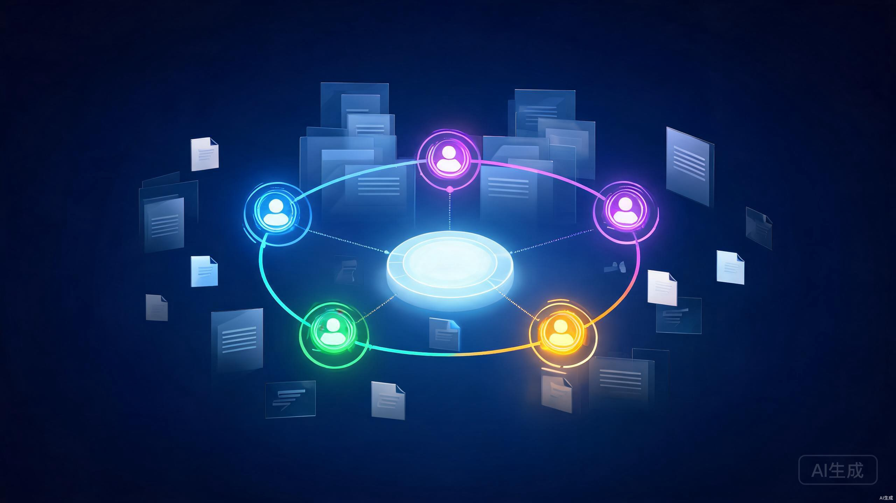
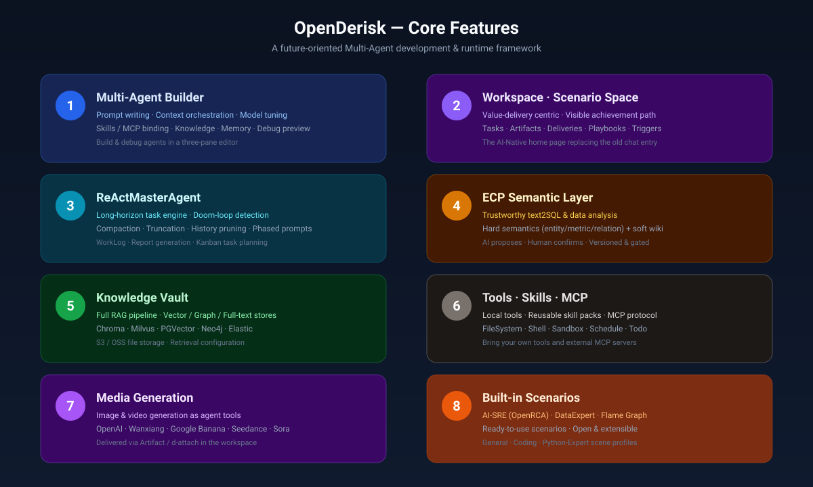
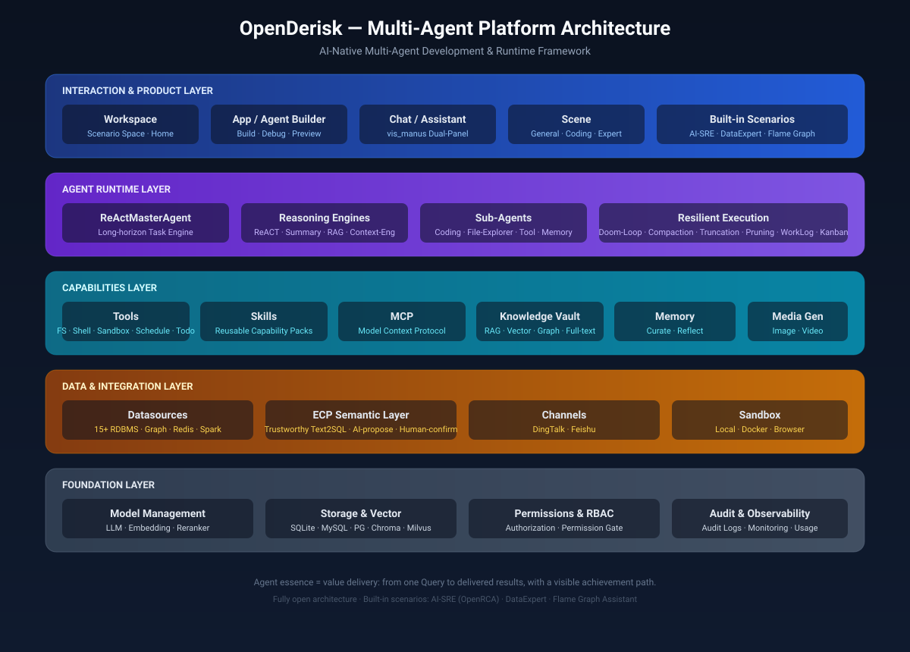
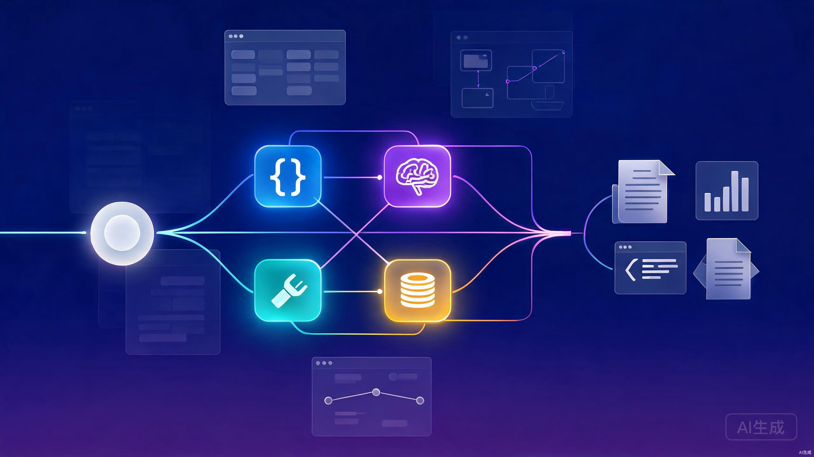

### OpenDerisk

OpenDerisk is an AI-Native **Multi-Agent development and runtime framework**. It lets you build, debug, and run collaborating agents that turn a single query into a delivered result — with the full achievement path visible to humans. Our vision is to provide every production system with a 7×24 AI teammate that handles complex tasks and safeguards system stability.

<div align="center">
  <p>
    <a href="https://github.com/derisk-ai/OpenDerisk">
        
    </a>
    <a href="https://github.com/derisk-ai/OpenDerisk">
        
    </a>
    <a href="https://opensource.org/licenses/MIT">
      
    </a>
     <a href="https://github.com/derisk-ai/OpenDerisk/releases">
      
    </a>
    <a href="https://github.com/derisk-ai/OpenDerisk/issues">
      
    </a>
    <a href="https://codespaces.new/derisk-ai/OpenDerisk">
      
    </a>
    <a href="https://discord.com/invite/bgWkskhe">
      
    </a>
  </p>

[**English**](README.md) | [**简体中文**](README.zh.md) | [**日本語**](README.ja.md) | [**Video Tutorial**](https://www.youtube.com/watch?v=1qDIu-Jwdf0)
</div>

<p align="center">
  
</p>

### News
- [2026/07] 🔥 Workspace-centric runtime & ECP semantic layer shipped; `ReActMasterAgent` 2.3 with resilient execution. See [OpenDerisk V0.2 ReleaseNote](./docs/docs/OpenDerisk_v0.2.md)
- [2025/10] OpenDerisk V0.2 released — a future-oriented Multi-Agent development & runtime framework.

### Core Features

<p align="center">
  
</p>

1. **Multi-Agent Builder** — Compose agents in a three-pane editor: system/user prompts, context resource orchestration, model & parameter tuning, skill/MCP binding, knowledge, memory, and live debug preview.
2. **Workspace (Scenario Space)** — The AI-native home page. It centers on value delivery and shows the achievement path (planning → execution → result), with tasks, artifacts, deliveries, playbooks, and triggers.
3. **ReActMasterAgent** — The long-horizon task engine: doom-loop detection, session compaction, tool-output truncation, history pruning, phased prompt management, work logs, report generation, and Kanban task planning.
4. **ECP Semantic Layer** — Trustworthy text2SQL & data analysis. AI proposes semantics (entities / metrics / relations); humans confirm via a permission gate. Numbers only come from confirmed metrics.
5. **Knowledge Vault** — A full RAG pipeline across vector (Chroma, Milvus, PGVector…), graph (Neo4j, TuGraph), and full-text stores, with S3/OSS file storage.
6. **Tools · Skills · MCP** — Built-in tools (filesystem, shell, sandbox, schedule, todo), reusable skill packs, and the Model Context Protocol for plugging in external servers.
7. **Media Generation** — Image & video generation as first-class agent tools (OpenAI, Wanxiang, Google Banana, Seedance, Sora), delivered as artifacts in the workspace.
8. **Built-in Scenarios** — AI-SRE (OpenRCA root-cause diagnosis), DataExpert, and Flame Graph Assistant, ready to use and open to extend.

### Architecture

<p align="center">
  
</p>

OpenDerisk is organized into five layers:

- **Interaction & Product Layer** — Workspace (home), App/Agent Builder, Chat/Assistant (with the vis_manus dual-panel layout), Scene profiles, and built-in scenarios.
- **Agent Runtime Layer** — `ReActMasterAgent` as the core, pluggable reasoning engines (ReACT, Summary-based, RAG deep-retrieval, Context-Engineering), sub-agents, and resilient-execution controls.
- **Capabilities Layer** — Tools, Skills, MCP, Knowledge Vault, Memory, and Media Generation.
- **Data & Integration Layer** — 15+ datasources, the ECP semantic layer, channels (DingTalk/Feishu), and sandbox (local/docker/browser).
- **Foundation Layer** — Model management (LLM/Embedding/Reranker), storage & vector stores, permissions/RBAC, and audit & observability.

The essence of an agent here is **value delivery**: from one query to a delivered result, with a visible achievement path that humans can inspect and trust.

### Install (recommended)

#### Install via curl

```shell
# Download and install latest version
curl -fsSL https://raw.githubusercontent.com/derisk-ai/OpenDerisk/main/install.sh | bash
```
#### Configuration File
After installation, the default configuration file is automatically initialized at:
`~/.openderisk/configs/derisk-proxy-aliyun.toml`

Edit this file and set your API keys:
```shell
vi ~/.openderisk/configs/derisk-proxy-aliyun.toml
```

#### Start 
```
openderisk-server  
```

### From source(development)

#### Install uv (required)

**macOS/Linux:**
```shell
curl -LsSf https://astral.sh/uv/install.sh | sh
```

**Windows:**
```shell
powershell -c "irm https://astral.sh/uv/install.ps1 | iex"
```

#### Clone and Install Dependencies

```shell
git clone https://github.com/derisk-ai/OpenDerisk.git

cd OpenDerisk

# Install Dependencies with uv
uv sync --all-packages --frozen \
    --extra "proxy_openai" \
    --extra "rag" \
    --extra "storage_chromadb" \
    --extra "derisks" \
    --extra "storage_oss2" \
    --extra "client" \
    --extra "ext_base" \
    --extra "channel_dingtalk"
```

> Note: `channel_dingtalk` is optional. Skip it if you don't need DingTalk channel support.

#### Start Server

**🚀 Quick Start (Zero Configuration, Recommended)**

Start without any configuration file:

```bash
# Method 1: Use quickstart command
uv run derisk quickstart

# Method 2: Use startup script
./start.sh

# Method 3: Specify port
uv run derisk quickstart -p 8888
```

After starting, visit http://localhost:7777 and configure models and settings through the web UI.

For detailed instructions, see: [Quick Start Guide](QUICKSTART.md)

**📝 Start with Configuration File**

Configure the API_KEY in `derisk-proxy-aliyun.toml`, then run:

```bash
# Start with configuration file
uv run derisk quickstart -c configs/derisk-proxy-aliyun.toml

# Or use traditional method
uv run python packages/derisk-app/src/derisk_app/derisk_server.py --config configs/derisk-proxy-aliyun.toml
```

#### Access Web UI

Open your browser and visit [`http://localhost:7777`](http://localhost:7777)

### Usage

#### Base Modules
Found under the **Settings** menu:
- **Model Management** — add / edit / remove LLM, Embedding, and Reranker models (OpenAI, Aliyun, Zhipu, local, etc.). Multi-model priority strategy supported.
- **Knowledge Base** — manage knowledge with the built-in RAG retrieval pipeline.
- **MCP** — manage and debug MCP services (CRUD + tool testing).
- **Prompts** — a unified editor for system & user prompts.

#### Build an Agent
Open **Application Management** → create or open an agent. The three-pane editor lets you configure the reasoning engine, model, skills/MCP, knowledge, and sub-agents, then debug with a live preview.

#### Built-in Scenarios
* **AI-SRE (OpenRCA root-cause diagnosis)**
  - Notice: uses the OpenRCA [Bank Dataset](https://drive.usercontent.google.com/download?id=1enBrdPT3wLG94ITGbSOwUFg9fkLR-16R&export=download&confirm=t&uuid=42621058-41af-45bf-88a6-64c00bfd2f2e)
  - Download: `gdown https://drive.google.com/uc?id=1enBrdPT3wLG94ITGbSOwUFg9fkLR-16R`
  - Extract datasets into `${derisk}/pilot/datasets`
* **Flame Graph Assistant** — upload Java/Python flame graphs from your local process for analysis
* **DataExpert** — upload metrics, logs, traces, or Excel data for conversational analysis

### Development
* **Agent Development** — see `packages/derisk-core/src/derisk/agent/expand/` (e.g. `react_master_agent`) and `packages/derisk-ext/src/derisk_ext/agent/agents/`
* **Tool Development** — Skills (`skills/`) and MCP (Model Context Protocol)
* **DeRisk-Skills** — [derisk-skills](https://github.com/derisk-ai/derisk_skills)

### Scenario Demo
Multi-Agent collaborating to handle a complex task — from one query to a delivered result, with a visible achievement path:
<p align="center">
  
</p>

### Citation
If you find this repository helpful, please cite:
```
@misc{di2025openderiskindustrialframeworkaidriven,
      title={OpenDerisk: An Industrial Framework for AI-Driven SRE, with Design, Implementation, and Case Studies}, 
      author={Peng Di and Faqiang Chen and Xiao Bai and Hongjun Yang and Qingfeng Li and Ganglin Wei and Jian Mou and Feng Shi and Keting Chen and Peng Tang and Zhitao Shen and Zheng Li and Wenhui Shi and Junwei Guo and Hang Yu},
      year={2025},
      eprint={2510.13561},
      archivePrefix={arXiv},
      primaryClass={cs.SE},
      url={https://arxiv.org/abs/2510.13561}, 
}
```

### Acknowledgement 
- [DB-GPT](https://github.com/eosphoros-ai/DB-GPT)
- [GPT-Vis](https://github.com/antvis/GPT-Vis)
- [MetaGPT](https://github.com/FoundationAgents/MetaGPT)
- [OpenRCA](https://github.com/microsoft/OpenRCA)

The OpenDerisk community is dedicated to building AI-native multi-agent systems. 🛡️ We hope our community can provide you with better services, and we also hope that you can join us to create a better future together. 🤝

[](https://star-history.com/#derisk-ai/OpenDerisk)


### Community Group

Join our DingTalk group and share your experience with other developers!

<div align="center" style="display: flex; gap: 20px;">
    
</div>
