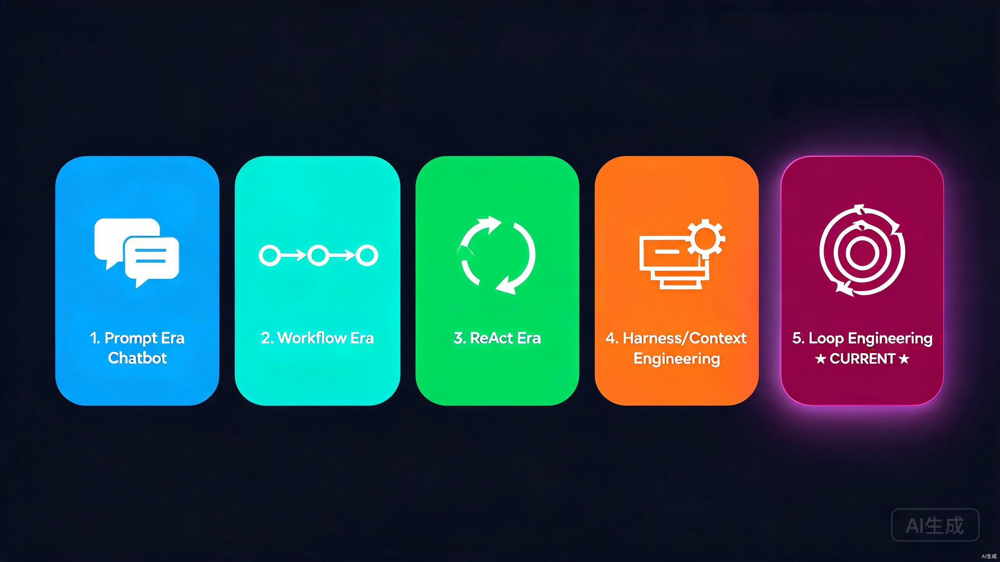
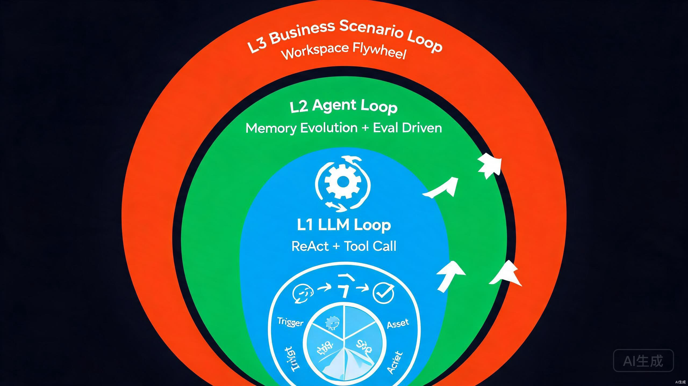
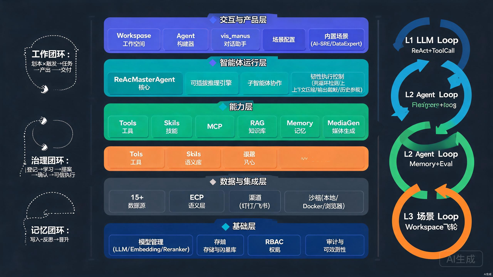
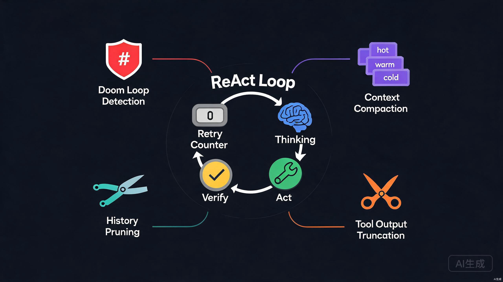
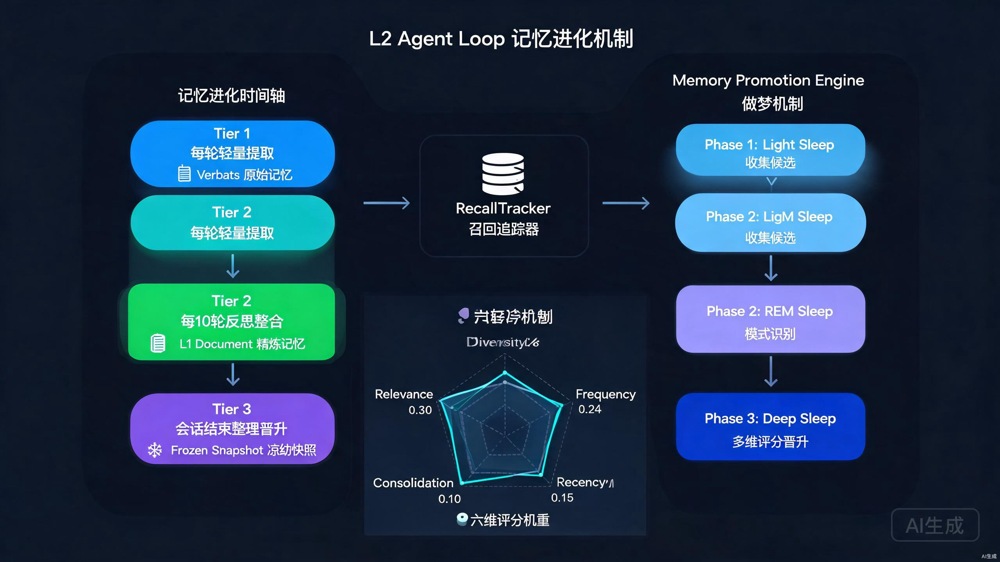
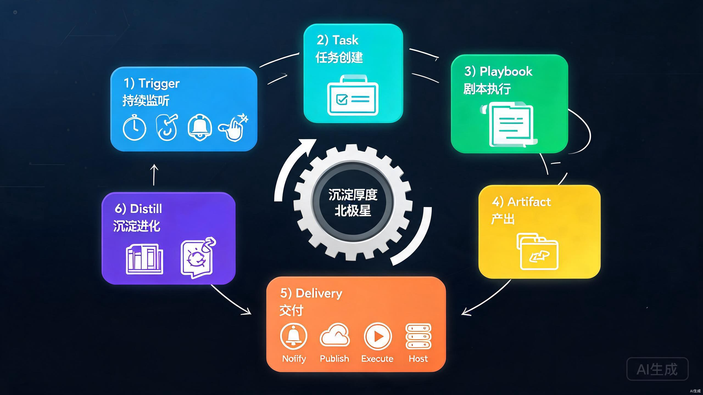

# 三层 Loop 工程时代：OpenDerisk 的技术思考与实践

> 从 Prompt 到 Loop，AI 产品正从"一次性回答"走向"持续参与"。本文梳理 AI 工程的五个演进时代，聚焦当前的 **Loop 工程时代**，并拆解 OpenDerisk 如何通过 **L1 LLM Loop / L2 Agent Loop / L3 业务场景 Loop** 三层嵌套循环，配合业务数据自主飞轮进化，构建一个"团队原生、越用越强"的 AI 产品。


---

## 一、AI 发展的五个时代

AI 应用工程经历了几年的迭代，每一代都在解决上一代留下的"不闭环"问题。



| 时代 | 核心范式 | 解决了什么 | 留下了什么新问题 |
|---|---|---|---|
| **Prompt 时代 · Chatbot** | 单轮/多轮对话 | 让 LLM 能"说话" | 无状态、无工具、对话结束一切蒸发 |
| **Workflow 时代** | 人工设定流程节点 | 让 LLM 接入工具、串成流水线 | 流程刚性，现实与流程不符即崩；改流程改 DSL |
| **ReAct 时代** | 全动态规划推进任务 | LLM 自己决定下一步做什么 | 长程任务容易跑飞、上下文爆炸、死循环 |
| **Harness / Context 工程时代** | 精细化运行过程与环境管理 | 控制上下文、约束执行、托管运行时 | 仍是"一次性任务"，任务结束智慧不沉淀 |
| **Loop 工程时代（当前）** | 三层嵌套循环 | 让 AI 从"完成任务"走向"持续参与场景" | — |

每一代的进步都伴随着"循环"的引入和加深：Workflow 是人写死的外层循环，ReAct 让循环进入 LLM 内部，Context 工程让循环变得可控，Loop 工程则把循环扩展到 **模型层、Agent 层、业务层** 三个维度，并把"沉淀—复用—进化"做成飞轮。

---

## 二、为什么是"Loop 工程时代"

前四个时代的共同假设是：**AI 处理的是一个独立的、有明确起止的任务**。但真实业务场景不是一个个孤立任务，而是**繁乱交织的事件和持续进行的工作**。

> 现实场景里，SRE 不是"完成一次故障定位"就结束，而是 7×24 持续监听告警、定位、应急、复盘、积累；数据运营不是"出一次月报"就结束，而是按月持续取数、对账、签收、沉淀口径。

如果要让 AI 原生地承担某个场景的工作，需要的不是"更强的单次任务能力"，而是**面向场景进行循环**：

- **持续监听接收任务**（事件驱动，不是人发起）
- **分析处理任务**（自主规划，不是人工编排）
- **完成交付积累迭代**（产出沉淀，不是用完即弃）
- **自主成长进化**（越用越懂这个团队，不是每次从零开始）

这就是 Loop 工程时代的核心命题。它包含三层 Loop，从内到外逐层嵌套。

---

## 三、三层 Loop 工程总览



| 层次 | 名称 | 循环本质 | 解决什么 | OpenDerisk 核心载体 |
|---|---|---|---|---|
| **L1** | LLM Loop | 思考 → 行动 → 验证 | 让模型循环起来解决复杂任务 | `ReActMasterAgent` |
| **L2** | Agent Loop | 记忆进化 + 评测驱动 | 让 Agent 面对复杂任务更准、更厉害 | `LongTermMemoryManager` + `MemoryPromotionEngine` |
| **L3** | 业务场景 Loop | 触发 → 执行 → 产出 → 沉淀 → 演化 | 通向 AIGC 的桥梁，让 Agent 在场景里变成真实角色 | `Workspace` + `Trigger` + `Playbook` + `Asset` |

三层是**嵌套驱动**关系：L3 的业务任务驱动 L2 的 Agent，L2 的 Agent 在每一步内执行 L1 的 LLM Loop。每一层的循环产物都会反哺上一层，形成"内层跑得稳、外层长得快"的协同。

> 关键洞察：三层 Loop 的本质是**把"循环"从模型内部一直延伸到业务场景**，让 AI 的能力从"一次性推理"升级为"持续参与并自我进化"。

---

## 四、全局架构视角

三层 Loop 不是悬空的概念，它们落地在 OpenDerisk 的五层架构之上。下图把"三层 Loop"与"五层架构"叠加，展示循环如何贯穿整个系统。



### 4.1 五层技术架构

| 架构层 | 颜色 | 承载内容 | 对应 Loop |
|---|---|---|---|
| **交互与产品层** | 蓝紫 | 工作空间、Agent 构建器、对话助手、场景配置、内置场景 | L3 的用户入口 |
| **智能体运行层** | 青绿 | ReActMasterAgent、可插拔推理引擎、子智能体、韧性执行控制 | L1 + L2 的运行核心 |
| **能力层** | 绿色 | 工具、技能、MCP、知识库 RAG、记忆、媒体生成 | L1 调用工具 / L2 读写记忆 |
| **数据与集成层** | 橙色 | 15+ 数据源、ECP 语义层、渠道（钉钉/飞书）、沙箱 | L3 触发与交付通道 |
| **基础层** | 深蓝 | 模型管理、存储与向量库、权限 RBAC、审计与可观测性 | 全栈底座 |

### 4.2 三个飞轮闭环

全局架构左侧标注了三个贯穿系统的飞轮闭环，它们正是三层 Loop 在数据层面的具象化：

```
① 工作闭环（L3 主驱动）
   剧本(怎么干) × 触发源(何时干) → 任务(一次执行) → 产出 → 交付 → 交付资产沉淀
                    ↑
              待办/干预(人介入解除阻塞)

② 治理闭环（L3 可信底座）
   资产登记 → spec 学习 → ECP 提案 → 人确认 → 语义目录(verified)
       ↑                                        │
       └────── 漂移检测 → 新提案 ←──────────────┘

③ 记忆闭环（L2 进化引擎）
   每轮写入 verbats → 每 10 轮反思整合 → 会话结束晋升 → 下次任务加速
```

- **工作闭环**让场景持续运转：触发器不停、任务不断、产出不息。
- **治理闭环**让数据可信：数字只能来自已确认指标，治理落工具面硬门禁。
- **记忆闭环**让 Agent 成长：跑过的任务变成下次的加速，越用越准。

三个闭环咬合：工作闭环的产出喂养记忆闭环，记忆闭环的晋升反哺工作闭环的 Agent 专精；治理闭环保证两个闭环里的数据可信。这就是"业务数据自主飞轮进化"的架构全貌。

---

## 五、L1 LLM Loop：让模型循环起来



### 5.1 核心循环：ReAct + Tool Call

L1 Loop 的核心是 ReAct 范式——**Thinking（思考）→ Act（行动）→ Verify（验证）** 的循环。OpenDerisk 的 [react_master_agent.py](../packages/derisk-core/src/derisk/agent/expand/react_master_agent/react_master_agent.py) 实现了这个循环，由 [base_agent.py](../packages/derisk-core/src/derisk/agent/core/base_agent.py) 的 `generate_reply` 驱动：

```python
while not done and self.current_retry_counter < self.max_retry_count:
    # 一轮 ReAct：思考 → 行动 → 验证
    self.init_reply_message()
    self._generate_think_message()  # Thinking
    self.act()                       # Act（并行执行所有工具调用）
    self.verify()                    # Verify
    self.current_retry_counter += 1
```

`max_retry_count` 默认 300，即一个任务最多执行 300 步 ReAct 循环。这给了 LLM 足够的"思考空间"来分解长程任务，但同时也带来了新的工程问题。

### 5.2 LLM Loop 的四大工程挑战

让 LLM 循环起来容易，让它在 300 步内不崩、不跑飞、不烧钱，才是 Loop 工程的难点。OpenDerisk 用四个机制守护循环（对应上方 L1 图示的外围四个模块）：

**① 死循环检测（Doom Loop Detection）**

LLM 会在卡住时反复调用同一个工具、同一组参数。[doom_loop_detector.py](../packages/derisk-core/src/derisk/agent/expand/react_master_agent/doom_loop_detector.py) 用 `IntelligentDoomLoopDetector` 对"工具名 + 规范化参数"做 SHA256 哈希，检测连续相同调用：

- `DEFAULT_THRESHOLD = 3`：连续 3 次相同调用即触发
- 三种处理动作：`ALLOW` / `BLOCK` / `ASK_USER`（通过权限系统请求用户确认）
- 在工具执行前检查，把"无限烧钱循环"扼杀在摇篮里

**② 上下文压缩（Context Compaction）**

300 步循环会产生海量历史消息，远超上下文窗口。OpenDerisk 把历史上 7 套压缩机制统一收敛为 [ContextEngine](../packages/derisk-core/src/derisk/agent/expand/react_master_agent/context_engine/engine.py)，构建一条 pipeline：

```
assemble → segment → layer → summarize_cold → render → guard.repair → 记账
```

- **分层（layering）**：按预算把历史分为 `hot / warm / cold` 三层，`history_budget_ratio=0.85`
- **冷层摘要**：`ColdSummarizer` 把 cold 层压缩成 `HandoffMessage`（冷层交接摘要）
- **不变量门禁**：`InvariantGuard` 在发送前做不变量检查与修复

辅助的 [UnifiedCompactionPipeline](../packages/derisk-core/src/derisk/agent/core/memory/compaction_pipeline.py) 实现四层压缩：截断 → 修剪 → 压缩归档 → 跨轮历史。

**③ 工具输出截断（Tool Output Truncation）**

工具返回 10MB 的日志会瞬间撑爆上下文。[truncation.py](../packages/derisk-core/src/derisk/agent/expand/react_master_agent/truncation.py) 的 `Truncator`（默认 `500 行 / 5KB`）在超限时：

- 把完整输出归档到 `AgentFileSystem`
- 生成 `d-attach` 组件标签，返回截断提示（含分页读取建议）

这样既保护了上下文，又没有丢失信息——Agent 需要时可以分页读回。

**④ 历史裁剪（History Pruning）**

基于使用率触发修剪（`prune_trigger_high_usage=0.8`），按比例保护（`prune_protect_ratio=0.15`），让上下文始终留有"呼吸空间"。

### 5.3 L1 Loop 的设计哲学

> **L1 Loop 的目标不是"让 LLM 一直跑"，而是"让 LLM 在 300 步内可控地跑完一个长程任务"。**

可控性来自四道闸门：死循环检测防"原地打转"，上下文压缩防"内存爆炸"，输出截断防"单步撑爆"，历史裁剪防"长期堆积"。这四道闸门让 ReAct 循环从"理论上可行"变成"工程上可靠"。

---

## 六、L2 Agent Loop：让 Agent 越用越准



L1 Loop 解决了"单次任务跑得稳"，但 Agent 每次启动仍是"白纸一张"。L2 Loop 的目标是**让跑过的任务变成下次的加速**——这是 Agent 真正"成长"的关键。

### 6.1 记忆进化三层机制（Tiered Memory Evolution）

[LongTermMemoryManager](../packages/derisk-core/src/derisk/agent/core/memory/longterm_manager.py) 实现了三层进化循环（对应上方 L2 图示的左侧时间轴），按频率分级：

| Tier | 频率 | 方法 | 做什么 |
|---|---|---|---|
| **Tier 1** | 每轮 | `write_turn_lightweight` | 轻量级逐字提取，写入 verbats（原始记忆） |
| **Tier 2** | 每 10 轮 | `reflect_on_last_n_turns` | 拉取最近 N 轮，跨轮去重/精炼，写入 L1 Document，建立 `derived-from` 边回溯源 verbats |
| **Tier 3** | 会话结束 | `curate_session` / `curate_space` | 执行晋升（高频召回→冻结）、陈旧归档、冻结快照稳定 prefix-cache |

这是一种**"在线学习"式的记忆进化**：不是等会话结束才总结，而是边跑边沉淀，每 10 轮做一次反思整合，会话结束做一次彻底整理。

### 6.2 召回追踪（RecallTracker）

记忆只有"被用上"才有价值。[recall_tracker.py](../packages/derisk-core/src/derisk/storage/memory/recall_tracker.py) 的 `RecallTracker` 持久化到 [recall_tracker.db](../data/memory/recall_tracker.db)，记录每条记忆的：

- `recall_count`（被召回次数）
- `total_score`（累计相关度）
- `query_hashes`（被哪些查询召回过）
- `recall_days`（跨越多少天被召回）

这些数据是**评测驱动记忆晋升**的基础——不是凭"感觉"决定哪些记忆重要，而是用真实召回数据说话。

### 6.3 记忆晋升引擎：三阶段"做梦"机制

[MemoryPromotionEngine](../packages/derisk-core/src/derisk/storage/memory/promotion.py) 借鉴人类睡眠的三阶段（对应上方 L2 图示的右侧），实现记忆从"短期"到"长期"的晋升：

| 阶段 | 名称 | 做什么 |
|---|---|---|
| **Phase 1** | Light Sleep（浅睡） | 从召回历史收集候选记忆 |
| **Phase 2** | REM Sleep（快速眼动） | 模式识别与概念标签分析 |
| **Phase 3** | Deep Sleep（深睡） | 多分量评分并晋升写入 |

**六维评分模型**（对应上方 L2 图示底部的雷达图，权重和为 1.0）：

| 维度 | 权重 | 含义 |
|---|---|---|
| Relevance | 0.30 | 平均搜索相关度 |
| Frequency | 0.24 | 召回频次 |
| Diversity | 0.15 | 唯一 query 数（被多少不同问题召回） |
| Recency | 0.15 | 时间衰减 |
| Consolidation | 0.10 | 召回跨越的天数（持续有用 vs 偶尔有用） |
| Conceptual | 0.06 | 概念标签数 |

晋升阈值 `promotion_threshold=0.5`，每轮最多晋升 10 条。这保证了"晋升"是有门槛的——只有真正反复被需要、跨多个问题、跨多天仍然有用的记忆，才会被固化成长期记忆。

### 6.4 评测驱动

记忆质量需要评测来闭环。OpenDerisk 的评测模块位于 [evaluation.py](../packages/derisk-serve/src/derisk_serve/agent/evaluation/)，提供评测指标驱动记忆质量优化。**评测驱动**的含义是：记忆的晋升、归档、冻结都基于可度量的召回数据，而不是凭启发式规则。

### 6.5 L2 Loop 的设计哲学

> **L2 Loop 的目标不是"记住所有事"，而是"让真正有用的记忆浮上来，让无用的沉下去"。**

这模拟了人类大脑的记忆机制——睡眠时整理记忆、反复用到的记牢、用不到的忘掉。Agent 不再是"每次从零开始"，而是带着"过去 N 次任务的经验"迎接新任务。

---

## 七、L3 业务场景 Loop：通向 AIGC 的桥梁



L1 和 L2 仍在"任务"维度循环——任务结束，循环结束。但真实场景是**持续进行的**。L3 Loop 把循环扩展到业务场景层，让 Agent 在场景里变成一个**真实角色自主持续参与**。

### 7.1 场景空间（Workspace）：持续监听的容器

L3 Loop 的载体是**场景空间**。OpenDerisk 的设计立场（来自 [SCENARIO_WORKSPACE_PRODUCT_DESIGN.md](./SCENARIO_WORKSPACE_PRODUCT_DESIGN.md)）：

> **场景空间 = 一个有准备的工作环境。数据已接好、口径已定义、方法已固化、权限已配好，Agent 进来就能干活，人只在关键节点介入。**

场景空间不是"一个对话"，而是"一个环境"——这是从"对话"到"环境"的产品单元升级。北极星指标是**沉淀厚度**：一个新成员（人或 Agent）进入空间，多快能达到"老师傅"的工作水平。

### 7.2 触发器（Trigger）：持续监听接收任务

L3 Loop 的入口是 [TriggerService](../packages/derisk-serve/src/derisk_serve/trigger/service/service.py)，统一四种触发源（对应上方 L3 飞轮的第一个节点）：

| 触发类型 | 场景 | 实现 |
|---|---|---|
| **timer** | 定时巡检、月报 | APScheduler cron job，到点调 `TriggerService.fire` |
| **webhook** | PR 合并、CI 事件 | HTTP webhook 接入 |
| **alert** | 监控告警 | 告警 webhook |
| **manual** | 用户主动发起 | chat 里说"跑一次巡检" |

四种触发统一走 `TriggerService.fire()` —— 创建 `pending_trigger` 状态的 Task，detached 启动执行，不阻塞调用方。**这是 L3 Loop 的"事件驱动"特性：Agent 不是等人发指令，而是持续监听场景事件。**

### 7.3 剧本（Playbook）：策略声明而非工作流脚本

L3 Loop 的执行核心是 Playbook（对应上方 L3 飞轮的第三个节点）。这里有一个关键的范式选择——**Playbook 不是 workflow 脚本，是策略声明**：

```yaml
playbook:
  skills:        # 这个场景能用哪些 Skill（Agent 自己选怎么用）
    - ref(resource:db_query_skill)
    - ref(resource:anomaly_detect_skill)
  context:       # 执行前强制加载的资产和资源
    assets_required: [...]
    resources: [...]
  gates:         # 不变量——某些条件下必须人介入
    - id: review_if_anomaly
      condition: "anomalies_detected == true"
      intervention: { type: review }
  deliverables:  # 必须产出什么、怎么分发
    - type: report
      delivery: [{ category: notify, channel: email }]
  distill:       # 必须沉淀什么
    forced: true
    produce: [{ type: historical_artifact }]
```

这个设计的精髓在于：**Playbook 不规定"怎么做"，只规定"必须满足什么约束、能用什么资源、必须产出什么"**。怎么做让 Agent 决定。这是 Agentic 时代的正确范式——把"步骤思维"留给 Skill 内部的 markdown 指引，不要上升到 Playbook 层。

执行流程（[runtime.py](../packages/derisk-serve/src/derisk_serve/playbook/runtime.py)）：

```
Trigger 触发 → 创建 Task（绑定 Playbook 快照版本）
  ↓
空间层组装上下文：加载 assets_required + 注入 skills 描述 + 注入 resources
  ↓
启动 Agent（一个通用 Agent，按 Skill 适配场景）← 这里进入 L1/L2 Loop
  ↓
Agent 自主编排：读 Skill → 调工具 → 触发 gate 时挂起
  ↓
gate 触发 → 创建 HumanIntervention → 等人处理 → 解除挂起 → Agent 继续
  ↓
Agent 完成 → 校验 deliverables 完整性 → 校验 distill 完成 → Task close
```

### 7.4 产出与交付（Artifact + Delivery）

L3 Loop 的产出不只是"chat 里的最后一条消息"（对应上方 L3 飞轮的第四、五个节点）。OpenDerisk 定义了四类交付，覆盖产出物的所有命运：

| 交付类别 | 做什么 | 例子 |
|---|---|---|
| **Notify 通知** | 把产出推给某人/某群 | 邮件发报告、飞书推卡片 |
| **Publish 发布** | 把产出写入外部持久系统 | 报表入 BI、代码 push 到 repo |
| **Execute 执行** | 把"操作计划"在真实世界执行 | 重启服务、部署代码、回滚 |
| **Host 托管** | 把产出在空间内托管、展示、运行 | 售前 demo 站、运营看板、运维历史站 |

**Host 类是关键差异化**：交付物的命运不是只有"发出去"。SRE 空间要长期托管运维操作历史，运营空间要托管看板/notebook，市场售前空间要托管调研站/demo——**空间不只是工作发生的地方，还是交付物栖居的地方**。

### 7.5 沉淀与演化（Distill + Playbook Evolution）

L3 Loop 之所以是"飞轮"而非"循环"，关键在**沉淀**（对应上方 L3 飞轮的第六个节点）：

- **强制 distill**：Task 关闭前强制校验沉淀完整性，未完成 distill 不允许 close（UI 不放行）。产出物沉淀为 Asset（historical_artifact / case / runbook / metric / template 等）。
- **Playbook 演化**：定期扫描某 Playbook 最近 N 次执行，统计 Skill 实际调用模式，识别"反复出现的额外步骤"或"反复被跳过的步骤"，生成 Playbook 修改提议推送给 owner 审批。**AI 不能自动改剧本**——所有提议必须人审批后才生效，这是红线。

### 7.6 人机分工宪法

> **Agent 自动跑，跑到需要人的地方，变成一条待办，出现在该出现的人的收件箱里。人不在流水线里，人在流水线的阀门上。**

这是 L3 Loop 的人机协作模式。所有人工阀门（Intervention 执行卡住、ECP 提案语义确认、交付审批、转交、手动待办）汇于**一个收件箱**。人处理完阀门，流水线继续自动跑。

### 7.7 L3 Loop 的设计哲学

> **L3 Loop 的目标不是"完成一个个任务"，而是"让场景空间越用越厚，让 Agent 在场景里变成真实角色"。**

L3 Loop 把 AI 从"工具"升级为"角色"——它持续在场景里值守、响应、积累、进化。这是通向 AIGC 的真正桥梁：AI 不再是"被调用时才存在"，而是"始终在场、持续成长"。

---

## 八、三层协同与数据飞轮

### 8.1 三层 Loop 的嵌套驱动

把前面三层总览、全局架构、L3 飞轮三张图叠起来看，三层 Loop 的嵌套驱动关系清晰可见：

```
L3 业务场景 Loop（持续）          ← 全局架构右侧最外层箭头 / L3 飞轮
   │  Trigger 触发 → 创建 Task → 启动 Playbook run_task
   ▼
L2 Agent Loop（会话级）           ← 全局架构右侧中层箭头 / L2 记忆进化图
   │  检索长期记忆注入上下文 → Agent 推理 → 每轮写入记忆 → 反思整合 → 晋升
   ▼
L1 LLM Loop（步级）               ← 全局架构右侧最内层箭头 / L1 图示
      Thinking（ContextEngine 压缩 + LLM 调用）
      → Act（工具执行 + Doom Loop 检测 + 输出截断）
      → Verify → Retry（最多 300 步）
```

- **L3 → L2**：业务 Task 通过 `playbook/runtime.py:run_task` 启动 Agent 会话，Agent 会话绑定 Memory 知识空间，触发 L2 的记忆循环。
- **L2 → L1**：`LongTermMemoryManager.retrieve_relevant_memories` 在 Agent 推理前注入长期记忆；`write_turn_lightweight` / `reflect_on_last_n_turns` 在每轮/每 10 轮后写入记忆。这些发生在 L1 ReAct 循环的 `thinking` 步骤内。
- **L1 内部**：`base_agent.generate_reply` 的 while 循环每轮 thinking → act → verify。
- **L3 闭环**：Trigger 持续监听 → fire 创建 Task → Playbook run_task 驱动 Agent → 产出 Artifact → Delivery 投递 → distill 沉淀为资产 → 演化剧本，形成"空间越用越厚"的飞轮。

### 8.2 业务数据的自主飞轮进化

三层 Loop 的最终目标是让业务数据**自主飞轮进化**（封面图右侧的六个咬合齿轮）。OpenDerisk 设计了六个咬合传动的飞轮：

| 飞轮 | 含义 | 载体 |
|---|---|---|
| **语义飞轮 Semantic** | 数据是什么、怎么算才对（声明式） | ECP 语义层（实体/指标/关系） |
| **剧本飞轮 Playbook** | 活怎么干（过程式） | Playbook declaration DSL + 版本演化 |
| **上下文飞轮 Context** | 场景的背景与历史 | Workspace 注入 + 记忆检索 |
| **知识飞轮 Knowledge** | 结构化的领域知识 | Knowledge Vault L0→L1→L2 流水线 |
| **能力飞轮 Capability** | 能用什么工具/Skill | SkillBundle + MCP + 演化提议 |
| **场景飞轮 Scenario** | 场景本身的积累 | Asset 沉淀 + Playbook 演化 + Agent 专精 |

六个飞轮相互咬合：语义飞轮让数据可信 → 剧本飞轮让方法可复用 → 上下文飞轮让 Agent 专精 → 知识飞轮让检索更准 → 能力飞轮让工具更强 → 场景飞轮让整体沉淀更厚——反过来又喂养语义飞轮。**这是一个自驱动的飞轮系统，业务数据越跑，飞轮转得越快，空间越用越厚。**

### 8.3 北极星：沉淀厚度

整个三层 Loop + 六飞轮的设计，都服务于一个北极星指标（上方 L3 飞轮的中心）——**沉淀厚度**：

> 一个新成员（人或 Agent）进入空间，多快能达到"老师傅"的工作水平。

度量它有五个指标：

| 指标 | 含义 |
|---|---|
| 资产就绪率 | 完成 spec 学习/语义确认的资产占比 |
| 语义覆盖率 | 任务查询走 ECP verified 通道 vs 直连之比 |
| 剧本复用率 | 触发源触发的任务占比（vs 一次性手动） |
| 待办响应时长 | 人的阀门是否瓶颈 |
| 沉淀增速 | 组织层条目数 × 空间年龄 |

---

## 九、OpenDerisk 的实践与思考

### 9.1 产品定位：团队原生的 AI 飞轮

OpenDerisk 的愿景是为每一个生产系统提供一个 7×24 小时协同工作的 AI 队友。它不是个人 Agent（如 Claude Code、Codex），而是**团队原生（Team-Native）** 的：

- **多智能体协作**：Agent 之间、Agent 与人之间按剧本协作
- **持续运行**：场景空间始终在线，触发器持续监听
- **组织继承**：跑过的任务沉淀为团队资产，新成员直接受益
- **RBAC 治理**：谁能调（能力门禁）× 能不能碰（资产门禁）
- **复利动能**：越用越懂这个团队，越用越快越准

这与主流个人 Agent 形成本质区别——个人 Agent 的循环止于"任务完成"，OpenDerisk 的循环止于"场景沉淀"。

### 9.2 三条工程纪律

在实现三层 Loop 的过程中，OpenDerisk 总结了三条工程纪律：

**① 治理落工具面硬门禁，prompt 只做引导**

> prompt 软约束打不过工具可用性。一切治理落工具面硬门禁，prompt 只做引导。

ECP 语义层、权限门禁、Execute 类 Approve，都不是靠 prompt 告诉 Agent"请不要做"，而是从工具面直接限制 Agent 能调什么、能碰什么。这是实测换来的纪律。

**② 声明式优于过程式**

Playbook 用声明式 DSL（skills + context + gates + deliverables + distill），而不是 workflow 步骤脚本。这让 LLM 的编排能力升级能直接享受——Playbook 是声明不限制，LLM 越强，执行越好。如果用 workflow DSL，LLM 编排能力升级反而享受不到。

**③ AI 提议，人决策**

Playbook 演化、ECP 语义确认、Execute 类执行——所有涉及"改变"的决策，AI 只识别 + 提议，永远人审批。AI 改自己的剧本是红线。这是让 AI"自主但不失控"的关键边界。

### 9.3 当前进展与未来

OpenDerisk V0.2 已落地：
- ReActMasterAgent 2.3 韧性执行（死循环检测、上下文压缩、输出截断、历史裁剪）
- 工作空间运行态与 ECP 语义层上线
- 完整 RAG 流程（向量/图/全文检索）
- 媒体生成作为一等公民智能体工具
- 内置场景：AI-SRE（OpenRCA 根因诊断）、DataExpert、火焰图助手

未来路线（[SCENARIO_WORKSPACE_DESIGN.md](./SCENARIO_WORKSPACE_DESIGN.md)）按 P0-P8 分期推进：从 IA 收敛、能力视图、收件箱收敛、剧本健康度，到 Host 类交付与托管运行时，逐步把"面向最终交付构建空间"落地。

---

## 十、总结：Loop 工程时代的三个判断

### 判断一：AI 产品的竞争，从"模型能力"转向"循环工程"

模型能力在趋同（GPT、Claude、Gemini、国产模型差距缩小）。真正拉开差距的是**如何让模型在真实场景里持续、可控、进化地工作**。这正是 Loop 工程要解决的问题。三层 Loop 不是"三个功能"，是"三种循环维度的工程能力"。

### 判断二：业务场景 Loop 是通向 AIGC 的真正桥梁

L1 LLM Loop 和 L2 Agent Loop 仍在"任务"维度。只有 L3 业务场景 Loop 把循环扩展到"持续进行的场景"，AI 才能从"被调用时才存在"变成"始终在场、持续成长的真实角色"。这是 AI 从"工具"到"角色"的跃迁。

### 判断三：飞轮进化是团队原生 AI 的护城河

个人 Agent 的循环止于"任务完成"，团队原生 AI 的循环止于"场景沉淀"。六个飞轮（语义/剧本/上下文/知识/能力/场景）相互咬合，业务数据越跑飞轮越快，空间越用越厚。这种**复利动能**是个人 Agent 无法复制的护城河——它让 OpenDerisk 不只是一个"更强的 Agent 平台"，而是一个"越用越强的团队 AI 飞轮"。

---

> **OpenDerisk：团队的 AI 飞轮，越用越强。**
>
> 通过业务数据的自主飞轮进化，实现三层 Loop 的 AI 产品——让 Agent 在场景里变成真实角色，自主持续参与，并能自主成长进化。

---

## 参考文档

- [项目 README](../README.zh.md)
- [场景空间产品设计](./SCENARIO_WORKSPACE_PRODUCT_DESIGN.md)
- [场景空间架构设计](./SCENARIO_WORKSPACE_DESIGN.md)
- [ReActMasterAgent 实现](../packages/derisk-core/src/derisk/agent/expand/react_master_agent/react_master_agent.py)
- [ContextEngine 上下文引擎](../packages/derisk-core/src/derisk/agent/expand/react_master_agent/context_engine/engine.py)
- [LongTermMemoryManager 记忆管理](../packages/derisk-core/src/derisk/agent/core/memory/longterm_manager.py)
- [MemoryPromotionEngine 记忆晋升](../packages/derisk-core/src/derisk/storage/memory/promotion.py)
- [TriggerService 触发器服务](../packages/derisk-serve/src/derisk_serve/trigger/service/service.py)
- [Playbook Runtime 剧本运行时](../packages/derisk-serve/src/derisk_serve/playbook/runtime.py)
- [RFC 设计提案目录](./RFC/README.md)
